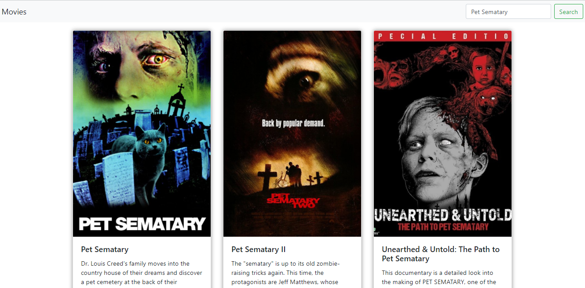

  <h3 align="center">React Movies</h3>

---

## Overview

Search for movies to read additional information about them.

## Preview

## APIs

- [The MovieDB API](https://www.themoviedb.org/documentation/api)

## Running the project

- Clone this repository
- Install all dependencies using the command `yarn`
- Run `yarn start`
- Access `http://localhost:3000/`

## Used technologies

- React
- Redux
- Redux Thunk
- React Router DOM
- Other React JS libs
